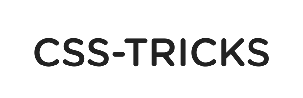

# Cboard - AAC Communication Board for browsers

[Cboard](https://app.cboard.io) is an augmentative and alternative communication (AAC) web application, allowing users with speech and language impairments (autism, cerebral palsy) to communicate with symbols and text-to-speech.

The app uses the browser's Speech Synthesis API to generate speech when a symbol is clicked. There are thousands of symbols from the most popular AAC symbol libraries to choose from when creating a board. Cboard is available in 40 languages (support varies by platform - Android, iOS, Windows).

**We're using Discord to collaborate, join us at: https://discord.gg/TEH8uxh**

## How does it work?

This video shows Srna. She is one of the children who have received the Cboard Communicator thanks to UNICEF’s ["For every child, a voice"](https://www.unicef.org/innovation/stories/giving-every-child-voice-aac-technology) project.

## Translations

The app supports 40 languages.
Languages were machine translated and require proofreading: if you want to help proofread, please use our translation management platform: https://crowdin.com/project/cboard

**You do not need to be a programmer!**

Translations play a major role in this project and they contribute a lot for the inclusion of children, specially in non developed countries. Please consider collaborating with us!

### Translations for developers

In order to pull the latest translations from CrowdIn into the codebase, you can run `yarn translations:pull`. This will update all language files such as `en.json` as well as the central `cboard.json` file. Please note that this requires the CrowdIn API key to be available in the `.private` config file. Refer to [Secrets Management](#secrets-management). After the script completes, changes to the translation files will need to be committed to the repo by the usual process.

## Getting Started

### `npm start` or `yarn start`

Runs the app in development mode. 
Open [http://localhost:3000](http://localhost:3000) to view it in the browser.

The page will reload if you make edits. 
You will see the build errors and lint warnings in the console.

### `npm test` or `yarn test`

Runs the test watcher in an interactive mode. 
By default, runs tests related to files changed since the last commit.

[Read more about testing.](https://github.com/facebookincubator/create-react-app/blob/master/packages/react-scripts/template/README.md#running-tests)

### `npm run build` or `yarn build`

Builds the app for production to the `build` folder. 
It correctly bundles React in production mode and optimizes the build for the best performance.

The build is minified and the filenames include the hashes. 
By default, it also [includes a service worker](https://github.com/facebookincubator/create-react-app/blob/master/packages/react-scripts/template/README.md#making-a-progressive-web-app) so that Cboard loads from local cache on future visits.

Cboard is ready to be deployed.

### `npm run build-cordova-debug`

Use this to produce non-minified build for use in debugging within Cordova. It uses `react-app-rewired` & `config-overrides.js` to  customize webpack operation without ejecting react.

See [CBoard](https://github.com/nous-/cboard) repo for packaging this CBoard application within Cordova.

## Docker getting started

### `make image`

Creates a Docker image with cboard built for production. The image is tagged as cboard:latest.

### `make run`

Runs the cboard:latest Docker image on port 5000.

## Secrets Management

Some external services have APIs we need to access, and these require API keys. To prevent open disclosure of these keys in the public repository, while still tracking them with the code, we encrypt some secrets into a GPG file. These files are `env/local-private.gpg` and `env/prod-private.gpg`.

In order to access the secrets, you must request the `ENCRYPTION_KEY` from @shaycojo and then run the decrypt script: `ENCRYPTION_KEY={key-goes-here} yarn decrypt:local` (or `prod`), which will create the file `.private/local.js` with the secrets in plain text where the scripts can access them. **The files in `.private` should never be committed to the repository.**

If you need to add or change a secret, make the change to the `.private/local.js` file, and then run the encryption script: `ENCRYPTION_KEY={key-goes-here} yarn encrypt:local` (or `prod`).

_Note: These keys/secrets are *not* required to run or develop Cboard._ They are used with scripts by some team members.

## About the Cboard community

## Thanks

### Symbols sources

 [Mulberry](https://mulberrysymbols.org/)

 [ARASAAC](http://www.arasaac.org/)

 [Global Symbols](https://globalsymbols.com/)

### Translation

[  Crowdin](https://crowdin.com/) - for providing the localization management platform.

### Testing platform

[  Browserstack](https://www.browserstack.com/) - for providing the automation infrastructure for testing.

### Development

[  CSS Tricks](https://css-tricks.com) - for providing feedback and support from the early stage.

## Contributors

This project exists thanks to all the people who contribute. [[Contribute](CONTRIBUTING.md)].

## Backers

Thank you to all our backers! 🙏 [[Become a backer](https://opencollective.com/cboard#backer)]

## Sponsors

Support this project by becoming a sponsor. Your logo will show up here with a link to your website. [[Become a sponsor](https://opencollective.com/cboard#sponsor)]

## :memo: Legal & licenses

Copyright © 2017-2021, [OTTAA Project](https://ottaa-project.github.io/) & Cboard contributors.

This program is free software: you can redistribute it and/or modify it under the terms of the GNU General Public License version 3 as published by the Free Software Foundation.

* Code - [GPLv3](https://github.com/cboard-org/cboard/blob/master/LICENSE.txt)
* Mulberry Symbols - [CC BY-SA 4.0](https://creativecommons.org/licenses/by-sa/4.0/)
* ARASAAC Symbols - [CC BY-NC-SA 4.0](https://creativecommons.org/licenses/by-nc-sa/4.0/)
